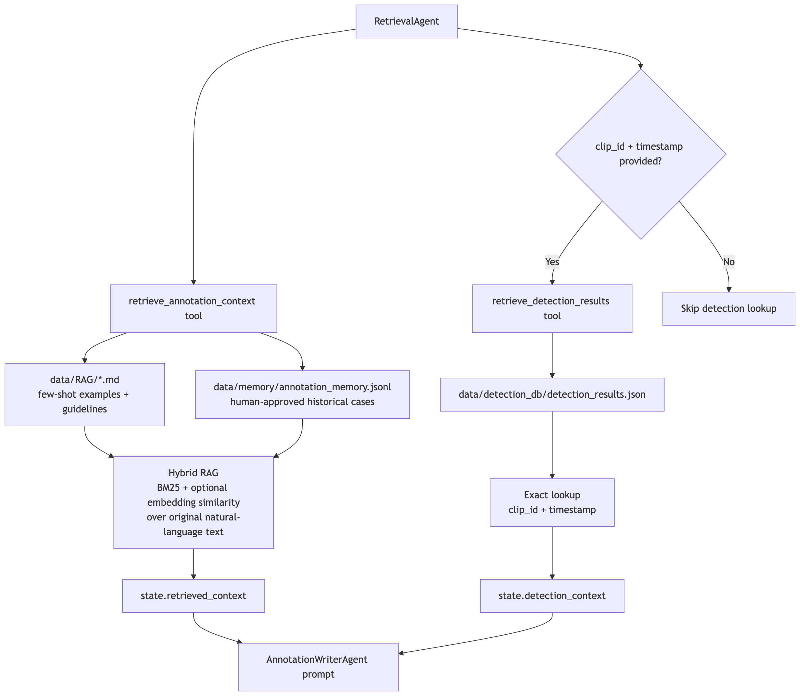

# 🚗 Multimodal Annotation Agent for Autonomous Driving

A multimodal intelligent annotation assistant based on **VLM** and **LangChain**. This tool can automatically convert annotators' natural language descriptions and scene images into standardized JSON annotation data that complies with Pydantic's strong constraints.


## ✨ Core Features

*   **Multimodal Understanding**：Integrates the Qwen-series large models to process both text descriptions and 
    driving scene images simultaneously.
*   **Strong Structured Output Validation**：Defines strict annotation schemas based on Pydantic (including weather, lanes, traffic signs, ego-vehicle behavior, etc.).
*   **Multi-Agent Workflow**：Splits the workflow into RetrievalAgent, MemoryAgent, PerceptionAgent, AnnotationWriterAgent, QualityAgent, and PersistenceAgent so each stage is easy to inspect.
*   **State Management**：Uses an explicit `AnnotationState` object to track request id, image paths, retrieved context, visual observations, drafts, validation errors, review status, feedback, final result, output path, and trace.
*   **LangChain Tool Calling**：Uses LangChain tools inside the explicit workflow for RAG retrieval (`retrieve_annotation_context`) and schema validation (`validate_json_output`), with tool calls surfaced in trace logs.
*   **Hybrid RAG + Approved Case Retrieval**：Retrieves relevant local few-shot examples from `data/RAG/` and human-approved historical cases from `data/memory/annotation_memory.jsonl` with BM25 + optional embedding similarity over the original natural-language annotation text.
*   **Deterministic Detection Retrieval**：Retrieves raw vehicle-side detection results by exact `clip_id + timestamp` 
    from `data/detection_db/`, without using embeddings.
*   **Conversational Memory**：Keeps the current human review loop explicit: pending draft, reviewer feedback, revised draft, approval, and final persistence.
*   **Both Automatic and Human-in-the-loop Self-Correction**：Allow agent to view and self-correct the JSON 
    output against the predefined schema by itself through QualityAgent. Generates a validated draft first, waits for 
    reviewer approval, and only saves after approval. Reviewer feedback triggers JSON revision and schema re-validation.
*   **Few-shot Prompt Engineering**：Well-designed few-shot prompting that guides the model to precisely align with complex autonomous driving annotation standards through high-quality examples.
*   **Interactive Frontend**：Real-time chat interface built with Streamlit, supporting streaming output and result downloading.

## 🧠 Agent Architecture

```text
Input: Images + User text (Natural Language Description Annotation)
        │
        ▼
AnnotationState
        │
        ├─ RetrievalAgent ── calls retrieve_annotation_context + retrieve_detection_results tools
        ├─ PerceptionAgent ─ multimodal observation summary
        ├─ AnnotationWriter ─ schema-aware JSON draft generation
        ├─ QualityAgent ──── calls validate_json_output tool + repair loop
        ├─ MemoryAgent ───── pending review + user feedback management
        ├─ Human reviewer ── approve or request revision
        ├─ PersistenceAgent  save approved JSON to data/output
        └─ MemoryAgent ───── append approved case to data/memory/*.jsonl
        │
        ▼
Output: Structured JSON with annotation results
```


### Runtime sequence diagram


### Retrieval-source diagram



## 📂 Project Structure
```text
├── agent/
│   ├── annotation_agent.py      # Multi-agent orchestration and workflow control
│   ├── memory.py                # Human review state and approved-case memory writer
│   ├── rag.py                   # Hybrid BM25 + embedding local RAG store
│   └── tools/
│       ├── annotation_tools.py  # Validation and legacy annotation tools
│       ├── detection_tools.py   # Exact clip_id + timestamp detection lookup tool
│       ├── rag_tools.py         # RAG retrieval LangChain tool
│       └── middleware.py        # Tool/model logging middleware utilities
├── config/
│   ├── agent.yml
│   ├── model.yml
│   └── prompts.yml
├── data/
│   ├── RAG/                     # Standalone retrievable few-shot cases and guidelines
│   ├── detection_db/            # Vehicle-side detection database for direct lookup
│   ├── memory/                  # Runtime approved cases
│   ├── output/                  # Runtime approved JSON outputs
│   └── temp/                    # Runtime uploaded images
├── models/
│   └── factory.py               # Model factory
├── docs/
│   └── agent_flow.md            # Mermaid diagrams for workflow and retrieval flow
├── prompts/
│   ├── main_prompt.txt
│   └── few_shot_examples.txt    # Few-shot prompt examples, not used as RAG corpus
├── sample_data/                 # NuScenes sample images and descriptions
├── schemas/
│   ├── annotation_schema.py     # Final Pydantic annotation schema
│   └── state_schema.py          # Runtime AnnotationState and trace models
├── tests/                       # Pytest coverage for schema, RAG, memory, workflow, tools
├── utils/                       # Config, paths, file IO, logging, prompt loading
├── run_app.py                   # Streamlit app
├── requirements.txt
└── README.md
```

## 🚀 Run

```bash
streamlit run run_app.py
```

Drafts are first shown for human review. Approved runs are saved to `data/output/` and appended to `data/memory/annotation_memory.jsonl` with `approved: true`, which makes them available to future RAG retrieval.

## 🔭 Recommended Next Iterations

1. Replace the in-memory hybrid retriever with a vector database such as FAISS/Chroma/Milvus for larger corpora.
2. Replace the Streamlit review controls with a richer bbox/action correction UI.
3. Add LangGraph when the workflow needs conditional routing, parallel specialist agents, or durable checkpoints.
