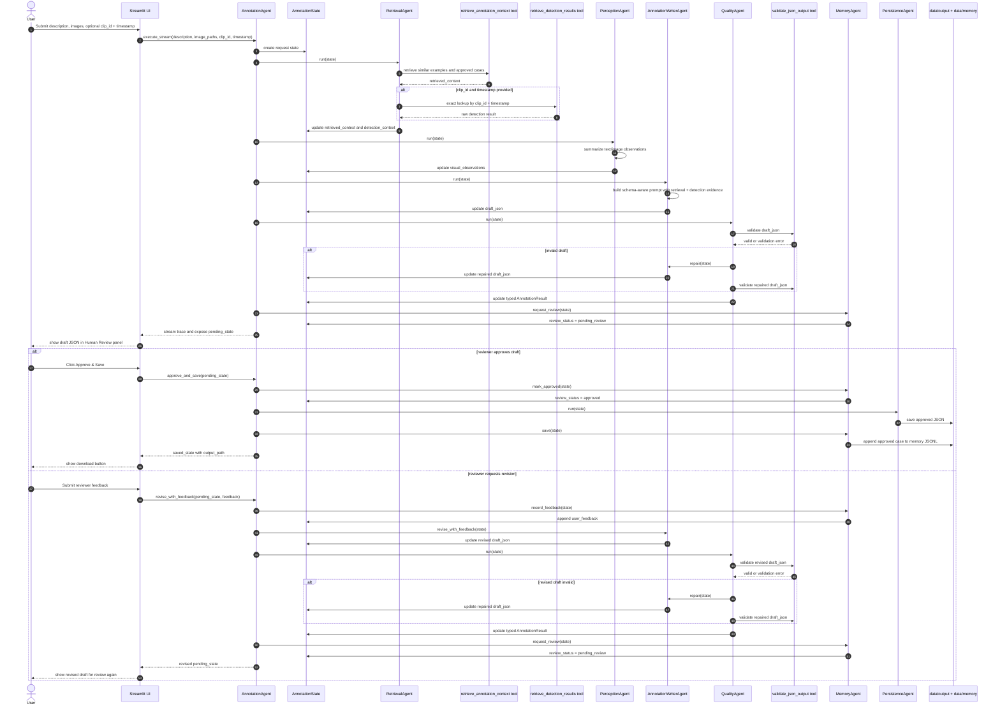
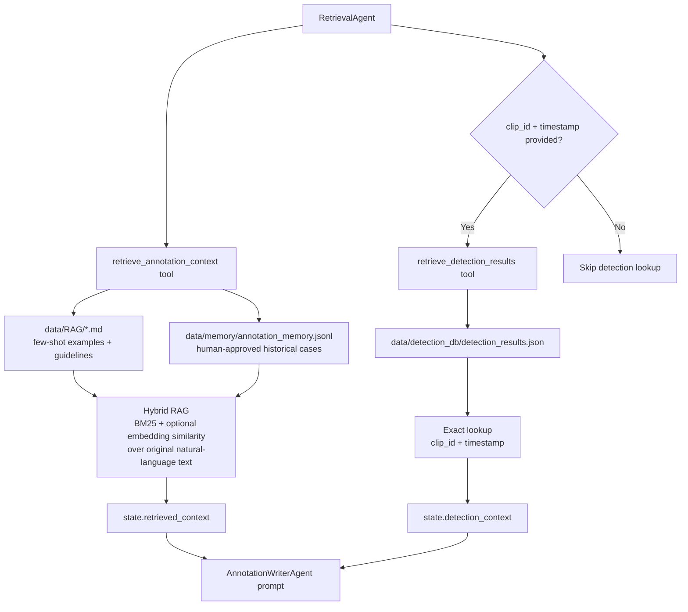

# Agent Flow Diagrams

1. The complete runtime sequence, including human review and revision.
2. The retrieval-source design.

## 1. Runtime Sequence with Human Review

```mermaid
sequenceDiagram
    autonumber
    actor User
    participant UI as Streamlit UI
    participant Orchestrator as AnnotationAgent
    participant State as AnnotationState
    participant Retrieval as RetrievalAgent
    participant RAGTool as retrieve_annotation_context tool
    participant DetTool as retrieve_detection_results tool
    participant Perception as PerceptionAgent
    participant Writer as AnnotationWriterAgent
    participant Quality as QualityAgent
    participant ValTool as validate_json_output tool
    participant Memory as MemoryAgent
    participant Persist as PersistenceAgent
    participant Output as data/output + data/memory

    User->>UI: Submit description, images, optional clip_id + timestamp
    UI->>Orchestrator: execute_stream(description, image_paths, clip_id, timestamp)
    Orchestrator->>State: create request state

    Orchestrator->>Retrieval: run(state)
    Retrieval->>RAGTool: retrieve similar examples and approved cases
    RAGTool-->>Retrieval: retrieved_context
    alt clip_id and timestamp provided
        Retrieval->>DetTool: exact lookup by clip_id + timestamp
        DetTool-->>Retrieval: raw detection result
    end
    Retrieval->>State: update retrieved_context and detection_context

    Orchestrator->>Perception: run(state)
    Perception->>Perception: summarize text/image observations
    Perception->>State: update visual_observations

    Orchestrator->>Writer: run(state)
    Writer->>Writer: build schema-aware prompt with retrieval + detection evidence
    Writer->>State: update draft_json

    Orchestrator->>Quality: run(state)
    Quality->>ValTool: validate draft_json
    ValTool-->>Quality: valid or validation error
    alt invalid draft
        Quality->>Writer: repair(state)
        Writer->>State: update repaired draft_json
        Quality->>ValTool: validate repaired draft_json
    end
    Quality->>State: update typed AnnotationResult

    Orchestrator->>Memory: request_review(state)
    Memory->>State: review_status = pending_review
    Orchestrator-->>UI: stream trace and expose pending_state
    UI-->>User: show draft JSON in Human Review panel

    alt reviewer approves draft
        User->>UI: Click Approve & Save
        UI->>Orchestrator: approve_and_save(pending_state)
        Orchestrator->>Memory: mark_approved(state)
        Memory->>State: review_status = approved
        Orchestrator->>Persist: run(state)
        Persist->>Output: save approved JSON
        Orchestrator->>Memory: save(state)
        Memory->>Output: append approved case to memory JSONL
        Orchestrator-->>UI: saved_state with output_path
        UI-->>User: show download button
    else reviewer requests revision
        User->>UI: Submit reviewer feedback
        UI->>Orchestrator: revise_with_feedback(pending_state, feedback)
        Orchestrator->>Memory: record_feedback(state)
        Memory->>State: append user_feedback
        Orchestrator->>Writer: revise_with_feedback(state)
        Writer->>State: update revised draft_json
        Orchestrator->>Quality: run(state)
        Quality->>ValTool: validate revised draft_json
        ValTool-->>Quality: valid or validation error
        alt revised draft invalid
            Quality->>Writer: repair(state)
            Writer->>State: update repaired draft_json
            Quality->>ValTool: validate repaired draft_json
        end
        Quality->>State: update typed AnnotationResult
        Orchestrator->>Memory: request_review(state)
        Memory->>State: review_status = pending_review
        Orchestrator-->>UI: revised pending_state
        UI-->>User: show revised draft for review again
    end
```

## 2. Retrieval Sources

```mermaid
flowchart TD
    A["RetrievalAgent"] --> B["retrieve_annotation_context tool"]
    A --> C{"clip_id + timestamp provided?"}

    B --> D["data/RAG/*.md<br/>few-shot examples + guidelines"]
    B --> E["data/memory/annotation_memory.jsonl<br/>human-approved historical cases"]
    D --> F["Hybrid RAG<br/>BM25 + optional embedding similarity<br/>over original natural-language text"]
    E --> F
    F --> G["state.retrieved_context"]

    C -->|Yes| H["retrieve_detection_results tool"]
    C -->|No| I["Skip detection lookup"]
    H --> J["data/detection_db/detection_results.json"]
    J --> K["Exact lookup<br/>clip_id + timestamp"]
    K --> L["state.detection_context"]

    G --> M["AnnotationWriterAgent prompt"]
    L --> M
```
